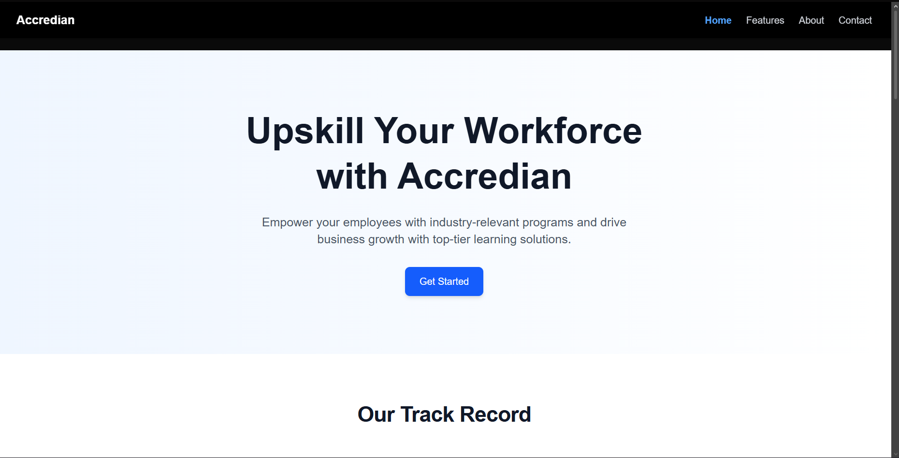
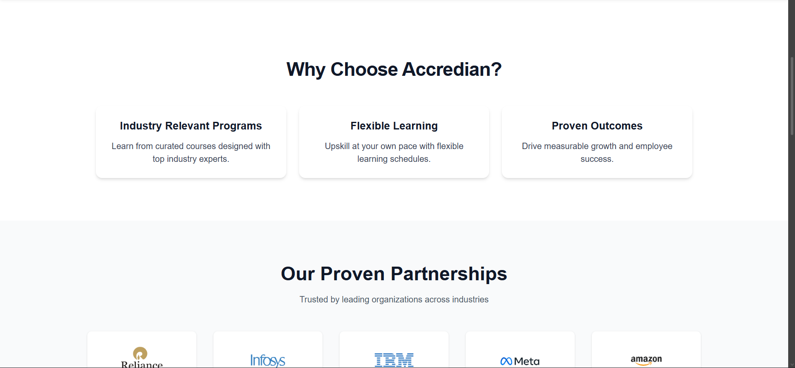
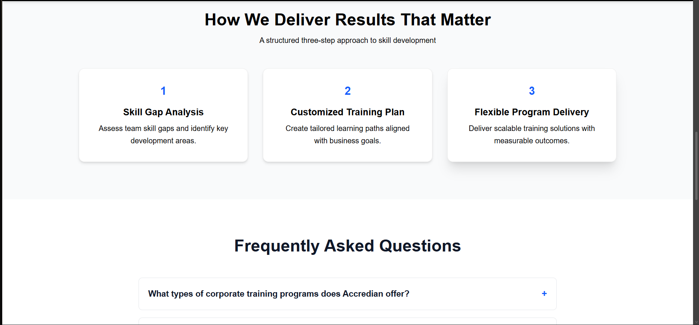
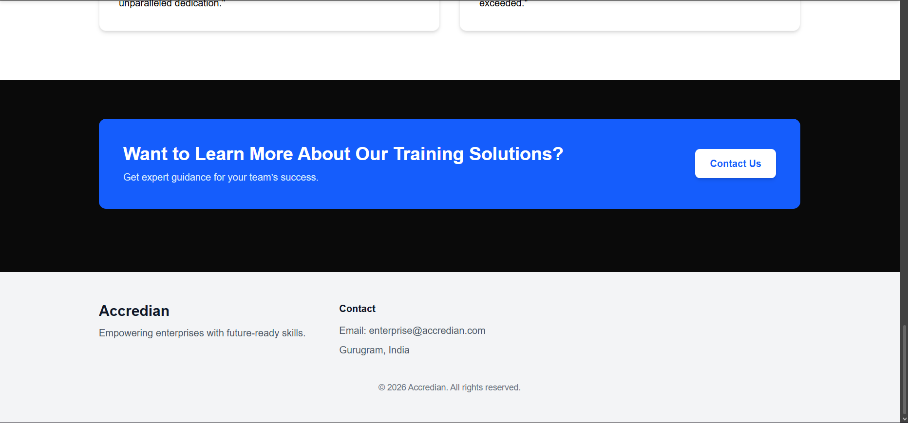

# Accredian Landing Page 🚀

A modern, responsive landing page built using Next.js and Tailwind CSS, inspired by Accredian’s enterprise learning platform.

## ✨ Features

* Fully responsive design across devices
* Smooth scrolling navigation
* Section-based layout with reusable components
* Interactive FAQ accordion
* Animated UI using Framer Motion
* Clean and modern UI inspired by real-world SaaS platforms

## 🛠 Tech Stack

* Next.js (App Router)
* Tailwind CSS
* Framer Motion

## 🌐 Live Demo

[https://your-vercel-link.vercel.app](https://accredian-landing-page-one.vercel.app)

## 📸 Screenshots






## 🚀 Getting Started

```bash
npm install
npm run dev
```

## 📌 About This Project

This project was built as part of an internship assignment to demonstrate frontend development skills, UI/UX understanding, and component-based architecture using modern web technologies.

## 🙌 Author

SuperCoder9000
